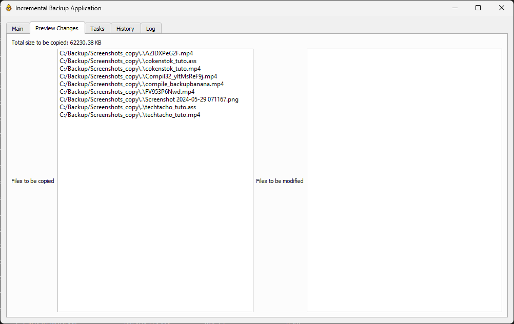

Pending ...

# BackupBanana

BackupBanana is a user-friendly, incremental backup application designed to simplify the process of creating and managing backups. This standalone application allows you to schedule backups, preview changes, and manage tasks, ensuring your important files are always backed up efficiently.

## Key Features

- **Incremental Backup**: Only copies new or modified files since the last backup, saving time and space.
- **Task Management**: Create and save backup tasks with specific source and destination directories.
- **Scheduling**: Schedule tasks to run at specific times (daily, weekly, etc.).
- **Preview Changes**: Preview the files that will be copied or modified before starting the backup.
- **Progress Bar**: Visual indication of the backup progress.
- **Error Logging**: Log files and folders that could not be backed up due to permission errors.
- **History and Logs**: View the history of backups and error logs.
- **System Tray Notifications**: Receive notifications about the backup status, including task names.
- **Administrative Privileges**: Ensure the application is run with administrative privileges for full functionality.

## Getting Started

### Prerequisites

Before running BackupBanana, you need to have the following installed on your machine:
- Windows 7 or later
- Python 3.x
- PyQt5
- Matplotlib
- Schedule

### Installation

1. Clone the repository or download the script to your local machine.
2. Install the required Python libraries with the following command:
   ```sh
   pip install pyqt5 matplotlib schedule


### Screenshots
|         |  |
|:-------------------------------------------:|:--------------------------------------:|
|                Start Backup                 |           Set up a Task List           |
|  |     |
|               Preview Changes               |             Backup Changes             |


